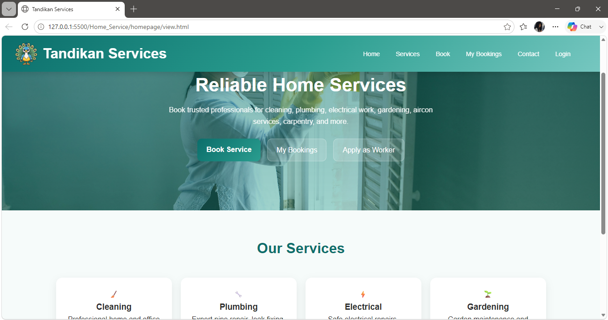
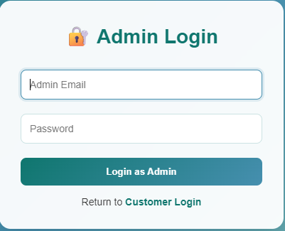
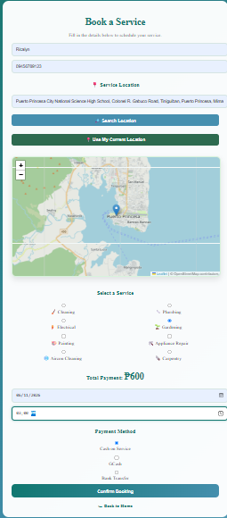
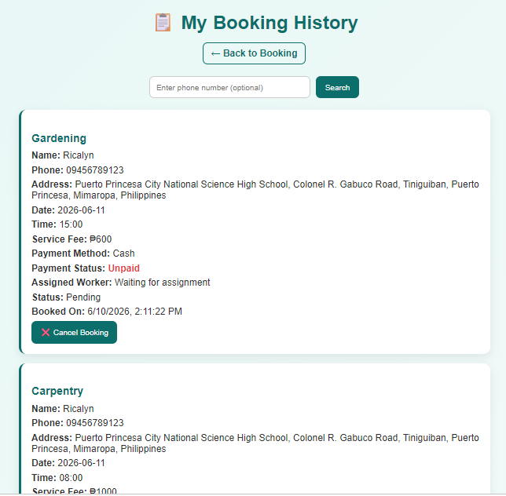
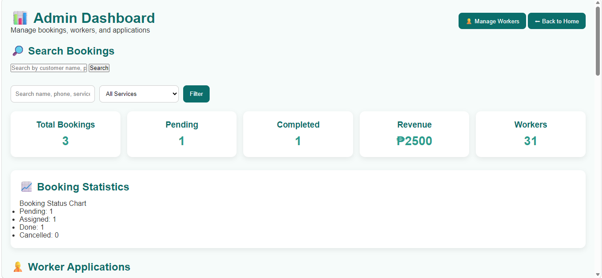

# Tandikan Services

> A web-based home service booking and worker management system that allows customers to book services, workers to manage assigned jobs, and administrators to oversee operations.

---

## Project Information

| Field            | Details                      |
| ---------------- | ---------------------------- |
| Subject          | Web Systems and Technologies |
| Academic Year    | 2025–2026                    |
| Project Category | Web Development              |
| Instructor       | Ma'am Divine Caabay          |

### Members

* Lenneth P. Arenio
* Ricalyn O. Olayvar

---

## Project Description

Tandikan Services is a web-based service booking platform designed to connect customers with skilled service workers. The system allows customers to register accounts, book home services, and monitor their booking history. Workers can apply for positions, receive assigned jobs, and update their job status through a dedicated worker dashboard. Administrators manage bookings, worker applications, worker accounts, and overall service operations through a centralized admin dashboard.

The project aims to provide a convenient and organized platform for scheduling and managing home services such as cleaning, plumbing, electrical work, gardening, painting, appliance repair, aircon cleaning, and carpentry.

---

## Features

### Customer Features

* User registration and login
* Service booking system
* Location-based booking information
* Booking history tracking
* Multiple service categories
* Payment method selection

### Worker Features

* Worker application submission
* Dedicated worker login
* Worker dashboard
* View assigned jobs
* Complete or cancel assigned jobs
* Profile and availability monitoring

### Administrator Features

* Secure admin login
* Dashboard statistics and reports
* Booking management
* Worker assignment system
* Worker application approval and rejection
* Worker account management
* Worker search functionality
* Edit worker information
* Service operation monitoring

---

## Technologies Used

### Frontend

* HTML5
* CSS3
* JavaScript (ES6)

### Libraries

* Leaflet.js
* OpenStreetMap

### Storage

* Browser Local Storage

### Development Tools

* Visual Studio Code
* Git
* GitHub

---

## System Workflow

### Customer Workflow

1. Register an account
2. Login to the system
3. Select a service
4. Complete the booking form
5. Submit booking request
6. Wait for worker assignment
7. View booking history

### Worker Workflow

1. Submit worker application
2. Wait for admin approval
3. Login to worker portal
4. View assigned jobs
5. Perform service
6. Complete assigned jobs

### Administrator Workflow

1. Login to admin dashboard
2. Review worker applications
3. Approve or reject applicants
4. Manage worker accounts
5. Assign workers to bookings
6. Monitor booking status
7. Monitor service operations

---

## Folder Structure

```text
tandikan services/

├── homepage/

│   ├── view.html

│   ├── style.css

│   ├── logo.png

│

├── Authentication/

│   ├── admin-login.html

│   ├── admin-login.js

│   ├── login.css

│   ├── login.js

│   ├── login.html

│   ├── signup.css

│   ├── signup.html

│   ├── signup.js

│   ├── worker-auth.js

│   ├── worker-login.css

│   ├── worker-login.html

│   ├── worker-login.js

│   ├── auth.js

│   ├── auth-ui.js

│

├── Bookings/

│   ├── booking.html

│   ├── booking.js

│   ├── storage.js

│   ├── style.css

│

├── History/

│   ├── history.html

│   ├── history.js

│   ├── history.css

│

├── Worker/

│   ├── worker-dashboard.css

│   ├── worker-dashboard.html

│   ├── worker-dashboard.js

│   ├── manage-workers.html

│   ├── manage-workers.js

│   ├── manage-workers.css

│

├── Admin/

│   ├── admin.html

│   ├── admin.js

│   ├── admin.css

│   ├── add-worker.html

│

├── WorkerApplication/

│   ├── apply-worker.html

│   ├── apply-worker.css

│   ├── apply-worker.js

│

├── Map/

│   ├── map.js

│   

└── assets/
```

---

## Installation Guide

### Clone the Repository

```bash
git clone https://github.com/PSU-CS-Academic-Projects/Tandikan-Home-Services-Booking-System.git
```

### Navigate to the Project Folder

```bash
cd Tandikan-Home-Services-Booking-System/src/tandikan services
```

### Run the Project

1. Open the project folder in Visual Studio Code.
2. Open `homepage/view.html`.
3. Run using Live Server or open the HTML file directly in a web browser.
4. Register a customer account.
5. Start booking services.

---

## Default System Accounts

### Administrator

```text
Email: admin@tandikan.com
Password: admin123
```

### Worker

Workers are created and approved by the administrator through the Worker Management module.

---

## Screenshots

### Homepage

 (screenshot/admin/homepage.png) (screenshot/user/Homepage.png)

### User Signup


### Login

(screenshot/user pages/Login.png)(screenshot/worker pages/Login.png)

### Service Booking



### Booking History



### Worker Dashboard


### Admin Dashboard



### Manage Workers


---

## Future Improvements

* Integration with a real database such as MySQL
* Online payment gateway integration
* SMS and email notifications
* Real-time booking updates
* Mobile-responsive enhancements
* Worker performance analytics
* Customer ratings and reviews
* Multi-admin support
* Cloud deployment
* Advanced reporting dashboard

---

## Conclusion

Tandikan Services provides a complete web-based platform for managing home service bookings, worker assignments, and administrative operations. The system demonstrates the practical application of web development concepts, user authentication, role-based access control, local storage management, and service workflow automation in a real-world service environment.
