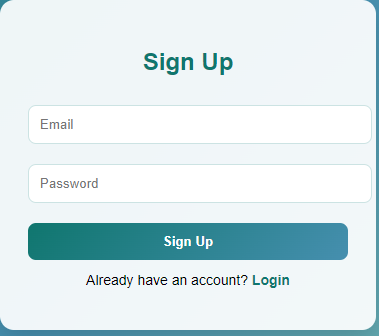
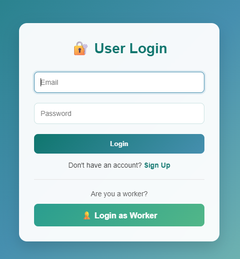
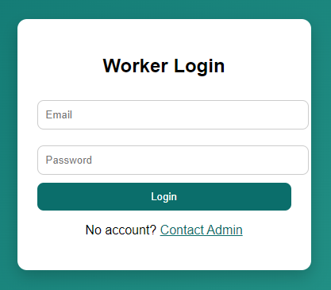
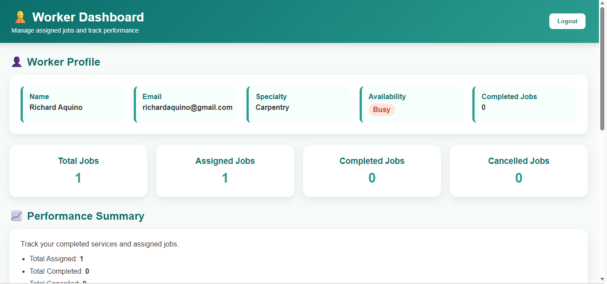
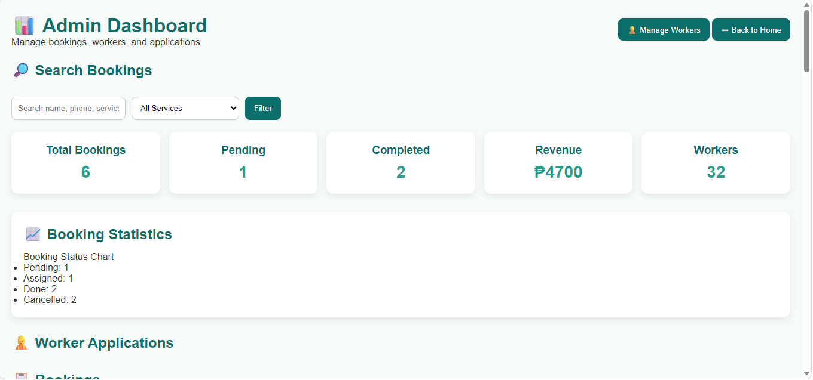
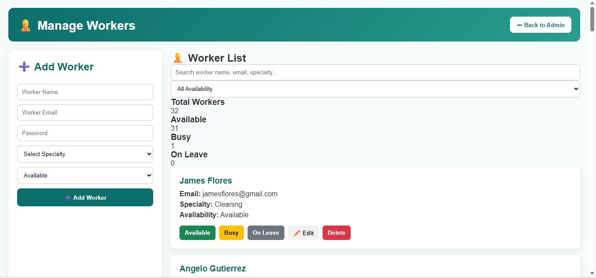

# Tandikan Home Services Booking System

> A web-based home service booking and worker management system that allows customers to book services, workers to manage assigned jobs, and administrators to oversee operations.

---

## Project Information

| Field            | Details                      |
| ---------------- | ---------------------------- |
| Subject          | Web Systems and Technologies |
| Academic Year    | 2025–2026                    |
| Project Category | Web Development              |
| Instructor       | Ma'am Divine Caabay          |

### Members

* Lenneth P. Arenio
* Ricalyn O. Olayvar

---

## Project Description

Tandikan Home Services Booking System is a web-based platform designed to connect customers with skilled service workers for various home maintenance and repair services. The system enables customers to register accounts, book services, and track their booking history. Workers can apply for positions, access assigned jobs through a dedicated dashboard, and update job statuses. Administrators oversee the entire system through an administrative dashboard that manages bookings, worker applications, worker accounts, and service operations.

The project aims to provide a convenient, organized, and user-friendly solution for managing home services such as cleaning, plumbing, electrical work, gardening, painting, appliance repair, aircon cleaning, and carpentry.

---

## Features

### Customer Features

* User registration and login
* Service booking system
* Location-based booking information
* Booking history tracking
* Multiple service categories
* Payment method selection
* View booking status updates

### Worker Features

* Worker application submission
* Dedicated worker login portal
* Worker dashboard
* View assigned jobs
* Complete assigned jobs
* Cancel assigned jobs when necessary
* Profile and availability monitoring

### Administrator Features

* Secure administrator login
* Dashboard statistics and reports
* Booking management
* Worker assignment system
* Worker application approval and rejection
* Worker account management
* Worker search functionality
* Edit worker information
* Worker availability management
* Service operation monitoring

### Security Features

* Role-based access control
* Protected booking and history pages
* Session-based authentication
* Administrator-only management modules
* Separate customer, worker, and admin access levels

---

## Technologies Used

### Frontend Technologies

* HTML5
* CSS3
* JavaScript (ES6)

### Mapping Technologies

* Leaflet.js
* OpenStreetMap

### Data Storage

* Browser Local Storage

### Development Tools

* Visual Studio Code
* Git
* GitHub

---

## System Workflow

### Customer Workflow

1. Register an account
2. Login to the system
3. Select a service
4. Complete the booking form
5. Submit booking request
6. Wait for worker assignment
7. Track booking status
8. View booking history

### Worker Workflow

1. Submit worker application
2. Wait for administrator approval
3. Login to worker portal
4. View assigned jobs
5. Perform assigned services
6. Update job status
7. Complete assigned jobs

### Administrator Workflow

1. Login to administrator dashboard
2. Review worker applications
3. Approve or reject applicants
4. Manage worker accounts
5. Assign workers to bookings
6. Monitor booking status
7. Monitor overall service operations

---

## Folder Structure

```text
TandikanServices/

├── homepage/
│   ├── view.html
│   ├── style.css
│   └── logo.png
│
├── Authentication/
│   ├── admin-login.html
│   ├── admin-login.js
│   ├── login.css
│   ├── login.js
│   ├── login.html
│   ├── signup.css
│   ├── signup.html
│   ├── signup.js
│   ├── worker-auth.js
│   ├── worker-login.css
│   ├── worker-login.html
│   ├── worker-login.js
│   ├── auth.js
│   └── auth-ui.js
│
├── Bookings/
│   ├── booking.html
│   ├── booking.js
│   ├── storage.js
│   └── style.css
│
├── History/
│   ├── history.html
│   ├── history.js
│   └── history.css
│
├── Worker/
│   ├── worker-dashboard.css
│   ├── worker-dashboard.html
│   ├── worker-dashboard.js
│   ├── manage-workers.html
│   ├── manage-workers.js
│   └── manage-workers.css
│
├── Admin/
│   ├── admin.html
│   ├── admin.js
│   ├── admin.css
│   └── add-worker.html
│
├── WorkerApplication/
│   ├── apply-worker.html
│   ├── apply-worker.css
│   └── apply-worker.js
│
├── Map/
│   └── map.js
│
└── assets/
```

---

## Installation Guide

### Clone the Repository

```bash
git clone https://github.com/PSU-CS-Academic-Projects/Tandikan-Home-Services-Booking-System.git
```

### Navigate to the Project Folder

```bash
cd Tandikan-Home-Services-Booking-System
```

### Run the Project

1. Open the project folder in Visual Studio Code.
2. Install the Live Server extension (optional).
3. Open `homepage/view.html`.
4. Right-click the file and select **Open with Live Server**.
5. Register a customer account or use the default administrator account.
6. Start using the system.

---

## Default Administrator Account

```text
Email: admin@tandikan.com
Password: admin123
```

## Default Worker Account

Worker accounts are created and approved by the administrator through the Worker Management module.

---

## Screenshots

### Homepage


### Customer Signup



### Customer Login



### Worker Login



### Administrator Login


### Service Booking


### Booking History


### Worker Dashboard



### Administrator Dashboard



### Manage Workers



---

## Future Improvements

* Integration with MySQL or Firebase database
* Online payment gateway integration
* SMS and email notification services
* Real-time booking updates
* Enhanced mobile responsiveness
* Worker performance analytics
* Customer rating and review system
* Multi-administrator support
* Cloud deployment
* Advanced reporting dashboard
* Automatic worker-job matching

---

## Conclusion

Tandikan Home Services Booking System is a web-based platform that streamlines the process of booking home services, managing workers, and overseeing service operations. Through role-based access control, booking management, worker assignment, worker monitoring, and administrative reporting, the system demonstrates the practical application of modern web development concepts using HTML, CSS, JavaScript, Local Storage, and interactive mapping technologies.
